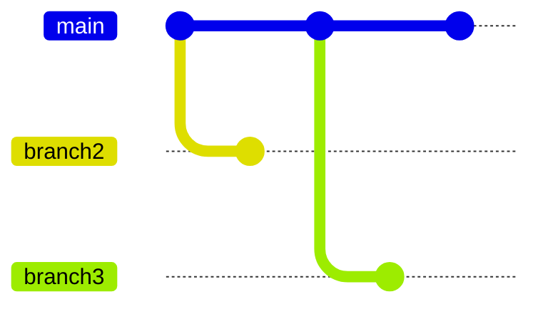

# README

```mermaid
%%{init:{'gitGraph':{'showCommitLabel':false}}}%%
gitGraph
    commit
    branch branch2
    commit
    checkout main
    commit
    branch branch3
    commit
    checkout main
    commit
```
